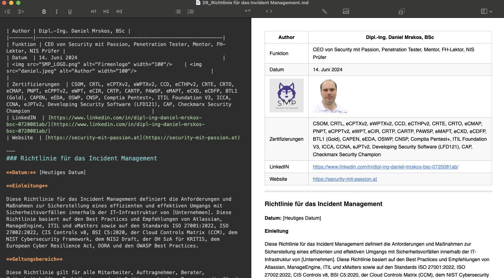

| Author | Dipl.-Ing. Daniel Mrskos, BSc |  
|--------|---------------------------------------------------------------|   
| Funktion | CEO von Security mit Passion, Penetration Tester, Mentor, FH-Lektor, NIS Prüfer |                               
| Datum  | 14. Juni 2024                                                 |
|     |                          |                                              |
| Zertifizierungen  | CSOM, CRTL, eCPTXv2, eWPTXv2, CCD, eCTHPv2, CRTE, CRTO, eCMAP, PNPT, eCPPTv2, eWPT, eCIR, CRTP, CARTP, PAWSP, eMAPT, eCXD, eCDFP, BTL1 (Gold), CAPEN, eEDA, OSWP, CNSP, Comptia Pentest+, ITIL Foundation V3, ICCA, CCNA, eJPTv2, Developing Security Software (LFD121), CAP, Checkmarx Security Champion                                         |
| LinkedIN  | [https://www.linkedin.com/in/dipl-ing-daniel-mrskos-bsc-0720081ab/](https://www.linkedin.com/in/dipl-ing-daniel-mrskos-bsc-0720081ab/)  
| Website  | [https://security-mit-passion.at](https://security-mit-passion.at)  

---
### Anleitung zur Nutzung der Policies

**Einleitung**

Diese Policies dienen als Basis für alle, die Sicherheitsrichtlinien zur Erfüllung von Compliance-Anforderungen und gesetzlichen Vorgaben implementieren möchten oder müssen. Die nachfolgenden Normen, Standards und Gesetze wurden als Grundlage für die Erstellung dieser Policies herangezogen:

- ISO 27001:2022
- TISAX Kontrollkatalog
- CIS Controls v8
- BSI C5:2020
- Cloud Controls Matrix (CCM)
- NIST Cybersecurity Framework
- NIS2 Draft
- OH SzA für KRITIS
- European Cyber Resilience Act
- Digital Operational Resilience Act (DORA)

**Polcies bearbeiten**

Im Ordner "Source" befinden sich alle .md-Dateien (Markdown), die sowohl mittels Copy-Paste in einem "What You See Is What You Get" (WYSIWYG) Editor wie beispielsweise von Confluence oder ähnlichen Tools kopiert werden können, als auch mittels Markdown-Editor als PDF kompiliert werden können. Security mit Passion hat für die Erstellung dieser Dokumente [Macdown](https://macdown.uranusjr.com) benutzt.

Es empfiehlt sich, die .md-Dateien mit einem Markdown-Editor auf die spezifischen Anforderungen und Bedürfnisse der eigenen Firma anzupassen, um sicherzustellen, dass sie den individuellen Sicherheits- und Compliance-Anforderungen gerecht werden.

---

**Haftungsausschluss**

Weder die Firma Security mit Passion noch der Autor Dipl.-Ing Daniel Mrskos, BSc haften für die Korrektheit oder Ausführlichkeit dieser Policies. Die bereitgestellten Richtlinien dienen lediglich als Orientierung und sollten individuell auf die spezifischen Anforderungen und Rahmenbedingungen des jeweiligen Unternehmens angepasst werden.

---

**Quellen und Referenzen**

| Quelle                                                                                          | Zweck                                                                  | Link                                                                                                             |
|-------------------------------------------------------------------------------------------------|------------------------------------------------------------------------|------------------------------------------------------------------------------------------------------------------|
| ISO27001:2022                                                                                   | Aufbau und Implementierung eines ISMS                                  | [ISO 27001:2022](https://www.iso.org/standard/27001)                                                             |
| CIS Controls v8                                                                                 | Sicherheitsmaßnahmen gegen Cyberangriffe                               | [CIS Controls v8](https://www.cisecurity.org/controls/v8)                                                        |
| BSI C5:2020                                                                                     | Cloud Security Standard                                                | [BSI C5:2020](https://www.bsi.bund.de/EN/Topics/CloudComputing/ComplianceControlsCatalogue/ComplianceControlsCatalogue_node.html) |
| Cloud Controls Matrix (CCM)                                                                     | Sicherheitskontrollen für Cloud-Dienste                                 | [Cloud Controls Matrix](https://cloudsecurityalliance.org/research/cloud-controls-matrix)                        |
| NIST Cybersecurity Framework                                                                    | Rahmenwerk zur Verbesserung der Cybersicherheit                        | [NIST CSF](https://www.nist.gov/cyberframework)                                                                  |
| NIS2 Draft                                                                                      | EU-Richtlinie zur Netz- und Informationssicherheit                      | [NIS2 Draft](https://eur-lex.europa.eu/legal-content/EN/TXT/?uri=CELEX%3A52020PC0823)                            |
| OH SzA für KRITIS                                                                               | Orientierungshilfe Angriffserkennung für Kritische Infrastrukturen     | [OH SzA](https://www.bsi.bund.de/SharedDocs/Downloads/DE/BSI/Kritis/BSI_Orientierungshilfe_Angriffserkennung.html)|
| European Cyber Resilience Act                                                                   | EU-Verordnung zur Cyber-Resilienz                                      | [European CRA](https://www.european-cyber-resilience-act.com)                                                    |
| Digital Operational Resilience Act (DORA)                                                       | EU-Verordnung zur digitalen operationellen Resilienz                   | [DORA](https://www.digital-operational-resilience-act.com)                                                       |

